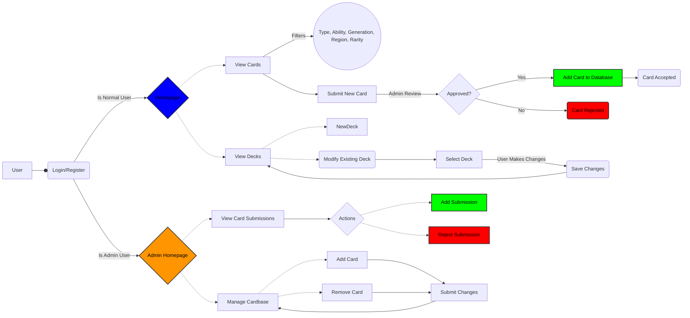
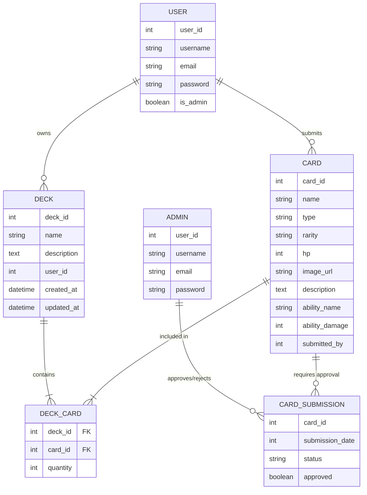

# Pokemon Card Storage Web Application Diagram

#### User Roles:
- Users should be able to:
    - View All Pokemon Cards
    - Submit new cards (pending admin approval)
    - Assemble and mange decks

- Admins should be able to:
    - Approve user-submitted cards
    - Add new cards
    - Modify and delete existing cards

- Core features:
    - Card Database: Store Pokémon cards with relevant stats
    - Deck Management: Users can create, edit, and remove decks
    - Role-Based Permissions: Admins can manage cards, users can only submit or assemble decks
    - Approval System: New cards require admin approval before being visible

## User & Admin Flow Diagram

## Entity-Relationship Diagram

## API Endpoints Table

```mermaid
    
    flowchart TD
    subgraph "Public Endpoints"
        NO1["/api/auth/register\n POST"]
        NO2["/api/auth/login\n POST"]
        NO3["/api/cards\n GET"]
        NO4["/api/cards/{card_id}\n GET"]
    end
    
    subgraph "User Access"
        U1["/api/auth/logout\n POST"]
        U2["/api/cards\n POST - Submit card"]
        U3["/api/decks\n GET - User's decks"]
        U4["/api/decks\n POST - Create deck"]
        U5["/api/users/me\n GET"]
    end
    
    subgraph "Owner Access"
        O1["/api/decks/{deck_id}\n GET"]
        O2["/api/decks/{deck_id}\n PUT"]
        O3["/api/decks/{deck_id}\n DELETE"]
        O4["/api/decks/{deck_id}/cards\n GET"]
        O5["/api/decks/{deck_id}/cards\n POST"]
        O6["/api/decks/{deck_id}/cards/{card_id}\n PUT"]
        O7["/api/decks/{deck_id}/cards/{card_id}\n DELETE"]
    end
    
    subgraph "Admin Access"
        A1["/api/cards/{card_id}\n PUT"]
        A2["/api/cards/{card_id}\n DELETE"]
        A3["/api/cards/pending\n GET"]
        A4["/api/cards/{card_id}/approve\n PUT"]
        A5["/api/cards/{card_id}/reject\n PUT"]
        A6["/api/users/{user_id}\n GET"]
        A7["/api/users/{user_id}/admin\n PUT"]
    end

    %% Resource flow
    User[User] --> NO1 & NO2
    User --> |Authentication| U1 & U2 & U3 & U4 & U5
    User --> |Owns Resource| O1 & O2 & O3 & O4 & O5 & O6 & O7
    User --> |Admin Rights| A1 & A2 & A3 & A4 & A5 & A6 & A7
    
    %% Style
    classDef public fill:#982020,stroke:#000000,color:#FF
    classDef user fill:#205f98,stroke:#000000,color:#FF
    classDef owner fill: #2f9426,stroke:#000000,color:#FF
    classDef admin fill: #cb6216,stroke:#000000,color:#FF
    
    class NO1,NO2,NO3,NO4 public
    class U1,U2,U3,U4,U5 user
    class O1,O2,O3,O4,O5,O6,O7 owner
    class A1,A2,A3,A4,A5,A6,A7 admin
    

```

    
    
    